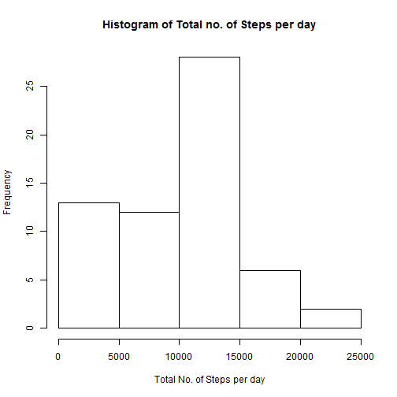
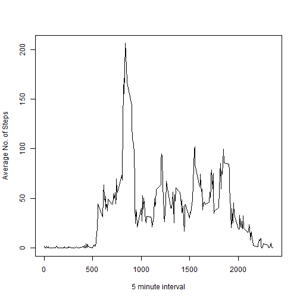
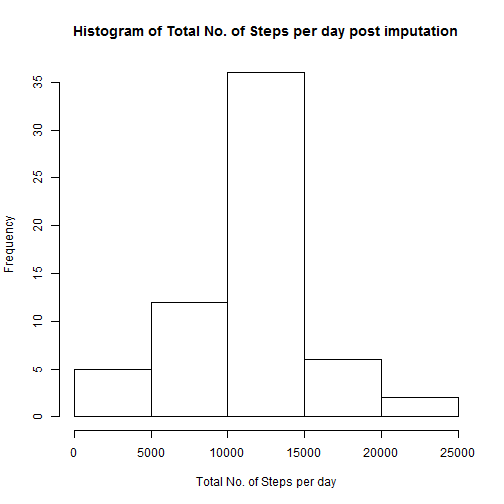

Submission for Course5 Week2
============================


```r
activity <- read.csv("activity.csv", stringsAsFactors=FALSE,header=T,na.strings = c("NA"))
library(data.table)
```

```
## data.table 1.10.0
```

```
##   The fastest way to learn (by data.table authors): https://www.datacamp.com/courses/data-analysis-the-data-table-way
```

```
##   Documentation: ?data.table, example(data.table) and browseVignettes("data.table")
```

```
##   Release notes, videos and slides: http://r-datatable.com
```

```r
setDT(activity)
```

Here is a Histogram of the Total No. of steps taken per day


```r
hist(activity[,.(steps_total_per_day = sum(steps,na.rm=T)),by=date][,steps_total_per_day], main="Histogram of Total no. of Steps per day", xlab = "Total No. of Steps per day")
```



Here is the Mean Total No. of Steps taken per day


```r
activity[,.(mean_steps_per_day = mean(steps,na.rm=T)),by=date][]
```

```
##           date mean_steps_per_day
##  1: 2012-10-01                NaN
##  2: 2012-10-02          0.4375000
##  3: 2012-10-03         39.4166667
##  4: 2012-10-04         42.0694444
##  5: 2012-10-05         46.1597222
##  6: 2012-10-06         53.5416667
##  7: 2012-10-07         38.2465278
##  8: 2012-10-08                NaN
##  9: 2012-10-09         44.4826389
## 10: 2012-10-10         34.3750000
## 11: 2012-10-11         35.7777778
## 12: 2012-10-12         60.3541667
## 13: 2012-10-13         43.1458333
## 14: 2012-10-14         52.4236111
## 15: 2012-10-15         35.2048611
## 16: 2012-10-16         52.3750000
## 17: 2012-10-17         46.7083333
## 18: 2012-10-18         34.9166667
## 19: 2012-10-19         41.0729167
## 20: 2012-10-20         36.0937500
## 21: 2012-10-21         30.6284722
## 22: 2012-10-22         46.7361111
## 23: 2012-10-23         30.9652778
## 24: 2012-10-24         29.0104167
## 25: 2012-10-25          8.6527778
## 26: 2012-10-26         23.5347222
## 27: 2012-10-27         35.1354167
## 28: 2012-10-28         39.7847222
## 29: 2012-10-29         17.4236111
## 30: 2012-10-30         34.0937500
## 31: 2012-10-31         53.5208333
## 32: 2012-11-01                NaN
## 33: 2012-11-02         36.8055556
## 34: 2012-11-03         36.7048611
## 35: 2012-11-04                NaN
## 36: 2012-11-05         36.2465278
## 37: 2012-11-06         28.9375000
## 38: 2012-11-07         44.7326389
## 39: 2012-11-08         11.1770833
## 40: 2012-11-09                NaN
## 41: 2012-11-10                NaN
## 42: 2012-11-11         43.7777778
## 43: 2012-11-12         37.3784722
## 44: 2012-11-13         25.4722222
## 45: 2012-11-14                NaN
## 46: 2012-11-15          0.1423611
## 47: 2012-11-16         18.8923611
## 48: 2012-11-17         49.7881944
## 49: 2012-11-18         52.4652778
## 50: 2012-11-19         30.6979167
## 51: 2012-11-20         15.5277778
## 52: 2012-11-21         44.3993056
## 53: 2012-11-22         70.9270833
## 54: 2012-11-23         73.5902778
## 55: 2012-11-24         50.2708333
## 56: 2012-11-25         41.0902778
## 57: 2012-11-26         38.7569444
## 58: 2012-11-27         47.3819444
## 59: 2012-11-28         35.3576389
## 60: 2012-11-29         24.4687500
## 61: 2012-11-30                NaN
##           date mean_steps_per_day
```

Here is the Median Total No. of Steps taken per day


```r
activity[,.(median_steps_per_day = median(steps,na.rm=T)),by=date][]
```

```
##           date median_steps_per_day
##  1: 2012-10-01                   NA
##  2: 2012-10-02                    0
##  3: 2012-10-03                    0
##  4: 2012-10-04                    0
##  5: 2012-10-05                    0
##  6: 2012-10-06                    0
##  7: 2012-10-07                    0
##  8: 2012-10-08                   NA
##  9: 2012-10-09                    0
## 10: 2012-10-10                    0
## 11: 2012-10-11                    0
## 12: 2012-10-12                    0
## 13: 2012-10-13                    0
## 14: 2012-10-14                    0
## 15: 2012-10-15                    0
## 16: 2012-10-16                    0
## 17: 2012-10-17                    0
## 18: 2012-10-18                    0
## 19: 2012-10-19                    0
## 20: 2012-10-20                    0
## 21: 2012-10-21                    0
## 22: 2012-10-22                    0
## 23: 2012-10-23                    0
## 24: 2012-10-24                    0
## 25: 2012-10-25                    0
## 26: 2012-10-26                    0
## 27: 2012-10-27                    0
## 28: 2012-10-28                    0
## 29: 2012-10-29                    0
## 30: 2012-10-30                    0
## 31: 2012-10-31                    0
## 32: 2012-11-01                   NA
## 33: 2012-11-02                    0
## 34: 2012-11-03                    0
## 35: 2012-11-04                   NA
## 36: 2012-11-05                    0
## 37: 2012-11-06                    0
## 38: 2012-11-07                    0
## 39: 2012-11-08                    0
## 40: 2012-11-09                   NA
## 41: 2012-11-10                   NA
## 42: 2012-11-11                    0
## 43: 2012-11-12                    0
## 44: 2012-11-13                    0
## 45: 2012-11-14                   NA
## 46: 2012-11-15                    0
## 47: 2012-11-16                    0
## 48: 2012-11-17                    0
## 49: 2012-11-18                    0
## 50: 2012-11-19                    0
## 51: 2012-11-20                    0
## 52: 2012-11-21                    0
## 53: 2012-11-22                    0
## 54: 2012-11-23                    0
## 55: 2012-11-24                    0
## 56: 2012-11-25                    0
## 57: 2012-11-26                    0
## 58: 2012-11-27                    0
## 59: 2012-11-28                    0
## 60: 2012-11-29                    0
## 61: 2012-11-30                   NA
##           date median_steps_per_day
```


Here is a time series plot of the 5-minute interval (x-axis) and the average number of steps taken, averaged across all days (y-axis):


```r
plot(unique(activity[,interval]),activity[,.(avg_no_of_steps_per_interval = mean(steps,na.rm=TRUE)),by=interval][,avg_no_of_steps_per_interval], type="l", xlab = "5 minute interval", ylab = "Average No. of Steps")
```



-------------
The 5-minute interval, on average across all the days in the dataset, is internal No. 835 and the average no. of steps is 206


```r
activity[,.(avg_no_of_steps_per_interval = mean(steps,na.rm=TRUE)),by=interval] [order(-avg_no_of_steps_per_interval)] [1,]
```

```
##    interval avg_no_of_steps_per_interval
## 1:      835                     206.1698
```

-------------
Imputing missing values
-----

The total number of rows with missing values in the dataset are 2304:


```r
activity[,.N] - sum(complete.cases(activity))
```

```
## [1] 2304
```

The mean no. of steps for that 5-minute interval is used for imputing below:

Aftre imputing the total no. of complete case now is:


```r
avg_steps_by_interval <- activity[,.(avg_no_of_steps_per_interval = mean(steps,na.rm=TRUE)),by=interval]
activity_imputed <- merge(activity, avg_steps_by_interval, by = "interval", all.x=T)
activity_imputed_final <- activity_imputed [,.(date, interval, steps = ifelse(is.na(steps),avg_no_of_steps_per_interval,steps))]
sum(complete.cases(activity_imputed_final))
```

```
## [1] 17568
```

The histogram of the total number of steps taken each day after imputing looks like below:


```r
hist(activity_imputed_final[,.(total_steps_per_day = sum(steps)),by=date][,total_steps_per_day],main="Histogram of Total No. of Steps per day post imputation",xlab="Total No. of Steps per day")
```



After imputation, the histogram looks more symmetric. Before Imputation, it was skewed to the left


After Imputation, the average no. of steps per day is shown below:


```r
activity_imputed_final[,.(avg_steps_per_day = mean(steps)), by=date][]
```

```
##           date avg_steps_per_day
##  1: 2012-10-01        37.3825996
##  2: 2012-10-02         0.4375000
##  3: 2012-10-03        39.4166667
##  4: 2012-10-04        42.0694444
##  5: 2012-10-05        46.1597222
##  6: 2012-10-06        53.5416667
##  7: 2012-10-07        38.2465278
##  8: 2012-10-08        37.3825996
##  9: 2012-10-09        44.4826389
## 10: 2012-10-10        34.3750000
## 11: 2012-10-11        35.7777778
## 12: 2012-10-12        60.3541667
## 13: 2012-10-13        43.1458333
## 14: 2012-10-14        52.4236111
## 15: 2012-10-15        35.2048611
## 16: 2012-10-16        52.3750000
## 17: 2012-10-17        46.7083333
## 18: 2012-10-18        34.9166667
## 19: 2012-10-19        41.0729167
## 20: 2012-10-20        36.0937500
## 21: 2012-10-21        30.6284722
## 22: 2012-10-22        46.7361111
## 23: 2012-10-23        30.9652778
## 24: 2012-10-24        29.0104167
## 25: 2012-10-25         8.6527778
## 26: 2012-10-26        23.5347222
## 27: 2012-10-27        35.1354167
## 28: 2012-10-28        39.7847222
## 29: 2012-10-29        17.4236111
## 30: 2012-10-30        34.0937500
## 31: 2012-10-31        53.5208333
## 32: 2012-11-01        37.3825996
## 33: 2012-11-02        36.8055556
## 34: 2012-11-03        36.7048611
## 35: 2012-11-04        37.3825996
## 36: 2012-11-05        36.2465278
## 37: 2012-11-06        28.9375000
## 38: 2012-11-07        44.7326389
## 39: 2012-11-08        11.1770833
## 40: 2012-11-09        37.3825996
## 41: 2012-11-10        37.3825996
## 42: 2012-11-11        43.7777778
## 43: 2012-11-12        37.3784722
## 44: 2012-11-13        25.4722222
## 45: 2012-11-14        37.3825996
## 46: 2012-11-15         0.1423611
## 47: 2012-11-16        18.8923611
## 48: 2012-11-17        49.7881944
## 49: 2012-11-18        52.4652778
## 50: 2012-11-19        30.6979167
## 51: 2012-11-20        15.5277778
## 52: 2012-11-21        44.3993056
## 53: 2012-11-22        70.9270833
## 54: 2012-11-23        73.5902778
## 55: 2012-11-24        50.2708333
## 56: 2012-11-25        41.0902778
## 57: 2012-11-26        38.7569444
## 58: 2012-11-27        47.3819444
## 59: 2012-11-28        35.3576389
## 60: 2012-11-29        24.4687500
## 61: 2012-11-30        37.3825996
##           date avg_steps_per_day
```

median steps per day:


```r
activity_imputed_final[,.(median_steps_per_day = median(steps)), by=date][]
```

```
##           date median_steps_per_day
##  1: 2012-10-01             34.11321
##  2: 2012-10-02              0.00000
##  3: 2012-10-03              0.00000
##  4: 2012-10-04              0.00000
##  5: 2012-10-05              0.00000
##  6: 2012-10-06              0.00000
##  7: 2012-10-07              0.00000
##  8: 2012-10-08             34.11321
##  9: 2012-10-09              0.00000
## 10: 2012-10-10              0.00000
## 11: 2012-10-11              0.00000
## 12: 2012-10-12              0.00000
## 13: 2012-10-13              0.00000
## 14: 2012-10-14              0.00000
## 15: 2012-10-15              0.00000
## 16: 2012-10-16              0.00000
## 17: 2012-10-17              0.00000
## 18: 2012-10-18              0.00000
## 19: 2012-10-19              0.00000
## 20: 2012-10-20              0.00000
## 21: 2012-10-21              0.00000
## 22: 2012-10-22              0.00000
## 23: 2012-10-23              0.00000
## 24: 2012-10-24              0.00000
## 25: 2012-10-25              0.00000
## 26: 2012-10-26              0.00000
## 27: 2012-10-27              0.00000
## 28: 2012-10-28              0.00000
## 29: 2012-10-29              0.00000
## 30: 2012-10-30              0.00000
## 31: 2012-10-31              0.00000
## 32: 2012-11-01             34.11321
## 33: 2012-11-02              0.00000
## 34: 2012-11-03              0.00000
## 35: 2012-11-04             34.11321
## 36: 2012-11-05              0.00000
## 37: 2012-11-06              0.00000
## 38: 2012-11-07              0.00000
## 39: 2012-11-08              0.00000
## 40: 2012-11-09             34.11321
## 41: 2012-11-10             34.11321
## 42: 2012-11-11              0.00000
## 43: 2012-11-12              0.00000
## 44: 2012-11-13              0.00000
## 45: 2012-11-14             34.11321
## 46: 2012-11-15              0.00000
## 47: 2012-11-16              0.00000
## 48: 2012-11-17              0.00000
## 49: 2012-11-18              0.00000
## 50: 2012-11-19              0.00000
## 51: 2012-11-20              0.00000
## 52: 2012-11-21              0.00000
## 53: 2012-11-22              0.00000
## 54: 2012-11-23              0.00000
## 55: 2012-11-24              0.00000
## 56: 2012-11-25              0.00000
## 57: 2012-11-26              0.00000
## 58: 2012-11-27              0.00000
## 59: 2012-11-28              0.00000
## 60: 2012-11-29              0.00000
## 61: 2012-11-30             34.11321
##           date median_steps_per_day
```

---------

Below is the Comparision of Average No. of steps per day before and after Imputation:


```r
mean_no_of_steps_per_day_before_imputation = activity[,.(mean_steps_per_day = mean(steps,na.rm=T)),by=date]
mean_no_of_steps_per_day_before_imputation = mean_no_of_steps_per_day_before_imputation[, date_new := as.POSIXct(date,format="%Y-%m-%d")]
mean_no_of_steps_per_day_after_imputation = activity_imputed_final[,.(mean_steps_per_day = mean(steps)),by=date]
mean_no_of_steps_per_day_after_imputation = mean_no_of_steps_per_day_after_imputation[, date_new := as.POSIXct(date,format="%Y-%m-%d")]
mean_no_of_steps_per_day_diff = merge(mean_no_of_steps_per_day_before_imputation, mean_no_of_steps_per_day_after_imputation, by="date_new", all.x=T)
mean_no_of_steps_per_day_diff[, ':=' (date.x = NULL, date.y = NULL)][]
```

```
##       date_new mean_steps_per_day.x mean_steps_per_day.y
##  1: 2012-10-01                  NaN           37.3825996
##  2: 2012-10-02            0.4375000            0.4375000
##  3: 2012-10-03           39.4166667           39.4166667
##  4: 2012-10-04           42.0694444           42.0694444
##  5: 2012-10-05           46.1597222           46.1597222
##  6: 2012-10-06           53.5416667           53.5416667
##  7: 2012-10-07           38.2465278           38.2465278
##  8: 2012-10-08                  NaN           37.3825996
##  9: 2012-10-09           44.4826389           44.4826389
## 10: 2012-10-10           34.3750000           34.3750000
## 11: 2012-10-11           35.7777778           35.7777778
## 12: 2012-10-12           60.3541667           60.3541667
## 13: 2012-10-13           43.1458333           43.1458333
## 14: 2012-10-14           52.4236111           52.4236111
## 15: 2012-10-15           35.2048611           35.2048611
## 16: 2012-10-16           52.3750000           52.3750000
## 17: 2012-10-17           46.7083333           46.7083333
## 18: 2012-10-18           34.9166667           34.9166667
## 19: 2012-10-19           41.0729167           41.0729167
## 20: 2012-10-20           36.0937500           36.0937500
## 21: 2012-10-21           30.6284722           30.6284722
## 22: 2012-10-22           46.7361111           46.7361111
## 23: 2012-10-23           30.9652778           30.9652778
## 24: 2012-10-24           29.0104167           29.0104167
## 25: 2012-10-25            8.6527778            8.6527778
## 26: 2012-10-26           23.5347222           23.5347222
## 27: 2012-10-27           35.1354167           35.1354167
## 28: 2012-10-28           39.7847222           39.7847222
## 29: 2012-10-29           17.4236111           17.4236111
## 30: 2012-10-30           34.0937500           34.0937500
## 31: 2012-10-31           53.5208333           53.5208333
## 32: 2012-11-01                  NaN           37.3825996
## 33: 2012-11-02           36.8055556           36.8055556
## 34: 2012-11-03           36.7048611           36.7048611
## 35: 2012-11-04                  NaN           37.3825996
## 36: 2012-11-05           36.2465278           36.2465278
## 37: 2012-11-06           28.9375000           28.9375000
## 38: 2012-11-07           44.7326389           44.7326389
## 39: 2012-11-08           11.1770833           11.1770833
## 40: 2012-11-09                  NaN           37.3825996
## 41: 2012-11-10                  NaN           37.3825996
## 42: 2012-11-11           43.7777778           43.7777778
## 43: 2012-11-12           37.3784722           37.3784722
## 44: 2012-11-13           25.4722222           25.4722222
## 45: 2012-11-14                  NaN           37.3825996
## 46: 2012-11-15            0.1423611            0.1423611
## 47: 2012-11-16           18.8923611           18.8923611
## 48: 2012-11-17           49.7881944           49.7881944
## 49: 2012-11-18           52.4652778           52.4652778
## 50: 2012-11-19           30.6979167           30.6979167
## 51: 2012-11-20           15.5277778           15.5277778
## 52: 2012-11-21           44.3993056           44.3993056
## 53: 2012-11-22           70.9270833           70.9270833
## 54: 2012-11-23           73.5902778           73.5902778
## 55: 2012-11-24           50.2708333           50.2708333
## 56: 2012-11-25           41.0902778           41.0902778
## 57: 2012-11-26           38.7569444           38.7569444
## 58: 2012-11-27           47.3819444           47.3819444
## 59: 2012-11-28           35.3576389           35.3576389
## 60: 2012-11-29           24.4687500           24.4687500
## 61: 2012-11-30                  NaN           37.3825996
##       date_new mean_steps_per_day.x mean_steps_per_day.y
```

After Imputation, we now see the Avg no. of steps per day for all days, before Imputation it was not available for the days in which readings were not available.


Below is the Comparision of Median No. of steps per day before and after Imputation:


```r
median_no_of_steps_per_day_before_imputation = activity[,.(median_steps_per_day = median(steps,na.rm=T)),by=date]
median_no_of_steps_per_day_before_imputation = median_no_of_steps_per_day_before_imputation[, date_new := as.POSIXct(date,format="%Y-%m-%d")]
median_no_of_steps_per_day_after_imputation = activity_imputed_final[,.(median_steps_per_day = median(steps)),by=date]
median_no_of_steps_per_day_after_imputation = median_no_of_steps_per_day_after_imputation[, date_new := as.POSIXct(date,format="%Y-%m-%d")]
median_no_of_steps_per_day_diff = merge(median_no_of_steps_per_day_before_imputation, median_no_of_steps_per_day_after_imputation, by="date_new", all.x=T)
median_no_of_steps_per_day_diff[, ':=' (date.x = NULL, date.y = NULL)][]
```

```
##       date_new median_steps_per_day.x median_steps_per_day.y
##  1: 2012-10-01                     NA               34.11321
##  2: 2012-10-02                      0                0.00000
##  3: 2012-10-03                      0                0.00000
##  4: 2012-10-04                      0                0.00000
##  5: 2012-10-05                      0                0.00000
##  6: 2012-10-06                      0                0.00000
##  7: 2012-10-07                      0                0.00000
##  8: 2012-10-08                     NA               34.11321
##  9: 2012-10-09                      0                0.00000
## 10: 2012-10-10                      0                0.00000
## 11: 2012-10-11                      0                0.00000
## 12: 2012-10-12                      0                0.00000
## 13: 2012-10-13                      0                0.00000
## 14: 2012-10-14                      0                0.00000
## 15: 2012-10-15                      0                0.00000
## 16: 2012-10-16                      0                0.00000
## 17: 2012-10-17                      0                0.00000
## 18: 2012-10-18                      0                0.00000
## 19: 2012-10-19                      0                0.00000
## 20: 2012-10-20                      0                0.00000
## 21: 2012-10-21                      0                0.00000
## 22: 2012-10-22                      0                0.00000
## 23: 2012-10-23                      0                0.00000
## 24: 2012-10-24                      0                0.00000
## 25: 2012-10-25                      0                0.00000
## 26: 2012-10-26                      0                0.00000
## 27: 2012-10-27                      0                0.00000
## 28: 2012-10-28                      0                0.00000
## 29: 2012-10-29                      0                0.00000
## 30: 2012-10-30                      0                0.00000
## 31: 2012-10-31                      0                0.00000
## 32: 2012-11-01                     NA               34.11321
## 33: 2012-11-02                      0                0.00000
## 34: 2012-11-03                      0                0.00000
## 35: 2012-11-04                     NA               34.11321
## 36: 2012-11-05                      0                0.00000
## 37: 2012-11-06                      0                0.00000
## 38: 2012-11-07                      0                0.00000
## 39: 2012-11-08                      0                0.00000
## 40: 2012-11-09                     NA               34.11321
## 41: 2012-11-10                     NA               34.11321
## 42: 2012-11-11                      0                0.00000
## 43: 2012-11-12                      0                0.00000
## 44: 2012-11-13                      0                0.00000
## 45: 2012-11-14                     NA               34.11321
## 46: 2012-11-15                      0                0.00000
## 47: 2012-11-16                      0                0.00000
## 48: 2012-11-17                      0                0.00000
## 49: 2012-11-18                      0                0.00000
## 50: 2012-11-19                      0                0.00000
## 51: 2012-11-20                      0                0.00000
## 52: 2012-11-21                      0                0.00000
## 53: 2012-11-22                      0                0.00000
## 54: 2012-11-23                      0                0.00000
## 55: 2012-11-24                      0                0.00000
## 56: 2012-11-25                      0                0.00000
## 57: 2012-11-26                      0                0.00000
## 58: 2012-11-27                      0                0.00000
## 59: 2012-11-28                      0                0.00000
## 60: 2012-11-29                      0                0.00000
## 61: 2012-11-30                     NA               34.11321
##       date_new median_steps_per_day.x median_steps_per_day.y
```

After Imputation, we now see the Median no. of steps per day for all days, before Imputation it was not available for the days in which readings were not available.

Weekdays and Weekends Comparision
---

Comparision of Average no. of steps per interval is shown in the chart below


```r
activity_imputed_final[, ':=' (day_of_the_week = ifelse(weekdays(as.POSIXct(date,'%Y-%m-%d')) %in% c("Monday","Tuesday","Wednesday","Thursday","Friday"),"weekday", "weekend" ))]
activity_imputed_final$day_of_the_week <- as.factor(activity_imputed_final$day_of_the_week)
activity_by_day_of_the_week = activity_imputed_final[,.(mean_steps_per_interval = mean(steps)),by=.(interval,day_of_the_week)]
qplot(interval, mean_steps_per_interval, data=activity_by_day_of_the_week, facets = .~day_of_the_week) + geom_line() + ggtitle('Comparision of Average Steps per Interval for Weekdays and Weekends')
```

```
## Error in eval(expr, envir, enclos): could not find function "qplot"
```

On Weekdays , around 8AM , maximum no. of steps is more than 225. This is the only peak in Weekdays. In Weekend, Peak is close to 170 steps in the morning and also multiple peaks close to this
through out the day.


